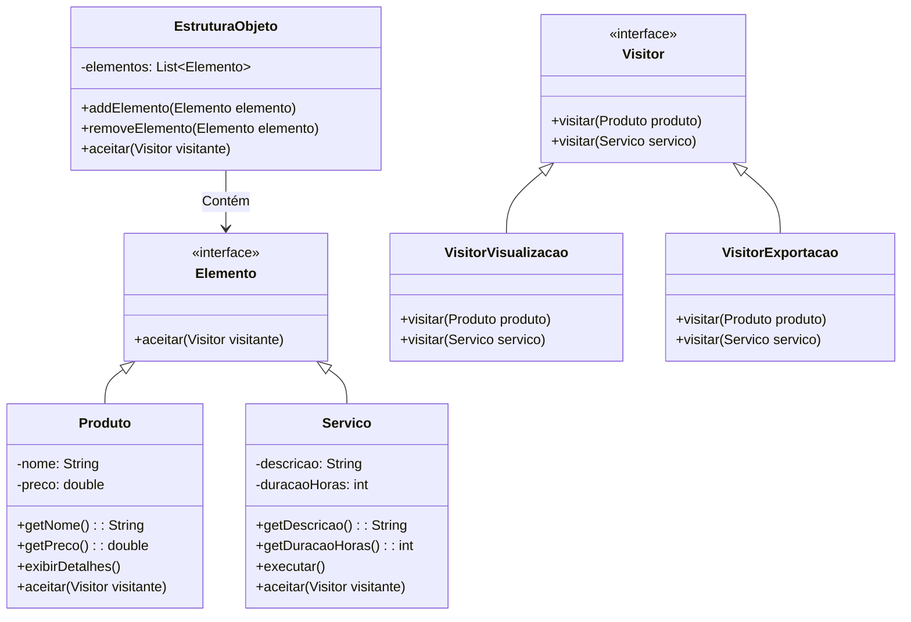

# Visitor

### Padrão de Projeto Comportamental

## Intenção
Descrever uma ação a ser realizada sobre os itens de um conjunto de objetos. O Visitor possibilita estabelecer uma nova funcionalidade sem alterar as classes dos componentes que serão processados.

## Motivação 
Imagine que você tem uma estrutura de objetos, como elementos de um documento (Texto e Imagem), e precisa realizar várias operações diferentes sobre eles — como imprimir, exportar, validar ou traduzir. Se cada operação for implementada diretamente nessas classes, elas acabam ficando sobrecarregadas e difíceis de manter. O padrão Visitor resolve isso ao permitir que essas operações sejam extraídas para classes separadas (visitantes), mantendo as classes de dados simples e focadas, e facilitando a adição de novas operações sem modificar os elementos existentes.

## Estrutura GOF


## Aplicabilidade 
Utilize o padrão Visitor nos seguintes cenários:

- Quando uma coleção de objetos possui múltiplas classes com interfaces distintas e você precisa aplicar operações que variam conforme o tipo de cada objeto.

- Diversas operações independentes devem ser realizadas sobre os elementos de uma estrutura, e você quer evitar sobrecarregar suas classes com essas funcionalidades. O Visitor agrupa operações relacionadas em uma única classe visitante, mantendo o código organizado.

- A estrutura de objetos é estável, mas novas operações são frequentemente adicionadas. Se a hierarquia de classes muda constantemente, implementar as operações diretamente nelas pode ser mais eficiente, já que alterações na estrutura exigem ajustes em todos os visitantes.

## Cenário Com o Visitor


## Participantes
- **Visitor (Visitor):** Define visitar(Produto) e visitar(Servico) para identificar e processar cada elemento.

- **ConcreteVisitor (VisitorExportacao, VisitorVisualizacao):** Implementam a lógica específica para cada elemento (Produto/Servico).
 Exemplo: VisitorExportacao extrai nome/preço (Produto) ou descrição/duração (Servico).

- **Element (Elemento):** Declara aceitar(Visitor) para permitir a visita.

- **ConcreteElemen(Produto, Servico):** Implementam aceitar(Visitor) chamando visitar(this), delegando a ação ao visitante.

- **ObjectStructure(EstruturaObjeto):** Armazena elementos (Produto, Servico) e aplica visitantes a todos via aceitar(Visitor)


## Código Com o Visitor

```java
public interface Visitor {
    void visitar(Produto produto);
    void visitar(Servico servico);
}
```
## Colaborações
- Um código cliente que implementa o Visitor precisa instanciar um VisitanteConcreto e iterar pela estrutura de objetos, aplicando a visita a cada componente

- Durante a visita, cada elemento aciona o método do Visitor correspondente ao seu tipo específico. O elemento se passa como parâmetro para essa chamada, possibilitando ao visitante consultar seus atributos quando requerido
## Consequências

## Benefícios
- **Facilidade para adicionar novas operações:** Com o Visitor, novas funcionalidades podem ser implementadas criando uma nova classe visitante, sem modificar as classes existentes dos elementos. Isso evita alterações em múltiplas classes quando uma nova operação é necessária.

- **Organização de operações relacionadas:** O padrão agrupa comportamentos relacionados em um único visitante, evitando a dispersão de lógica pelas classes da estrutura. Isso melhora a manutenibilidade e a clareza do código.

- **Suporte a estruturas heterogêneas:** Diferentemente de um Iterator, o Visitor pode operar sobre objetos de tipos distintos, mesmo que não compartilhem uma hierarquia comum.

- **Acúmulo de estado durante a visita:** Visitantes podem armazenar informações enquanto percorrem a estrutura, eliminando a necessidade de variáveis globais ou parâmetros extras.

## Desvantagens
- **Dificuldade para adicionar novos tipos de elementos:** Se a estrutura de objetos cresce frequentemente, cada novo tipo exige a atualização de todos os visitantes existentes, o que pode se tornar trabalhoso.

- **Violação do encapsulamento:** Para que o Visitor funcione, os elementos podem precisar expor métodos públicos que acessem seu estado interno, reduzindo o encapsulamento.
  
## Usos conhecidos
- Compiladores: Em compiladores, ele é usado para percorrer árvores de sintaxe abstrata (ASTs) e realizar operações como análise semântica ou geração de código

- Ferramentas de análise de código:
Ferramentas como linters e formatadores aplicam visitantes para analisar diferentes tipos de nós em estruturas de código-fonte, sem precisar alterar as classes que representam esses nós.

- Aplicações com documentos estruturados:
Sistemas que trabalham com documentos compostos por diferentes tipos de elementos (como texto, imagens e tabelas) utilizam Visitor para aplicar funcionalidades como exportação, renderização ou verificação em cada tipo de elemento.

## Padrões relacionados
- Composite:
Visitor é frequentemente usado com o padrão Composite para executar operações sobre uma hierarquia de objetos (como árvores). O visitante percorre a estrutura composta e realiza ações específicas para cada tipo de nó.

- Interpreter:
Em interpretadores de linguagens, o Visitor pode ser usado para implementar a lógica de interpretação, onde cada tipo de expressão é visitado e processado de forma distinta.

## Conclusão
O padrão Visitor é uma ferramenta valiosa para projetar sistemas flexíveis e extensíveis, especialmente quando há uma clara separação entre a estrutura de objetos e os comportamentos que operam sobre ela. Ele promove um design orientado a interfaces, facilitando a adição de novos comportamentos sem comprometer a integridade das classes existentes. No entanto, seu uso deve ser ponderado, pois ele pode introduzir complexidade desnecessária em cenários simples ou dinâmicos.

## Referências
GAMMA, Erich; HELM, Richard; JOHNSON, Ralph; VLISSIDES, John. Padrões de Projeto: Soluções Reutilizáveis de Software Orientado a Objetos. 1. ed. Porto Alegre: Bookman, 2000.
