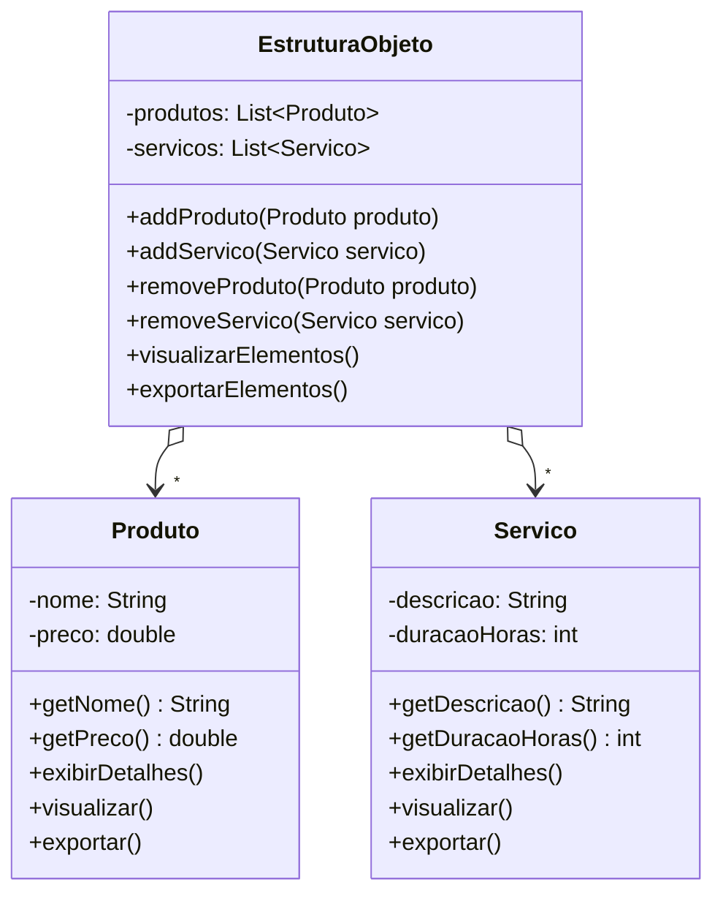
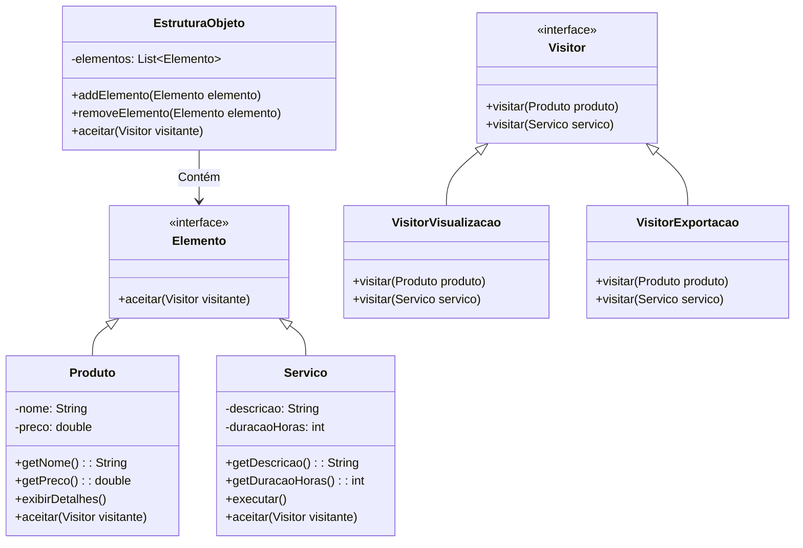

# Visitor

### Padrão de Projeto Comportamental

## Intenção
Descrever uma ação a ser realizada sobre os itens de um conjunto de objetos. O Visitor possibilita estabelecer uma nova funcionalidade sem alterar as classes dos componentes que serão processados.

## Motivação 
Imagine um sistema que lida com produtos  e serviços, onde esses itens precisam ser exibidos e exportados. Inicialmente, as operações de visualização e exportação são implementadas diretamente nas classes Produto e Servico. No entanto, à medida que surgem novas operações ou tipos de elementos, modificar essas classes se torna complicado e arriscado, além de misturar responsabilidades. 

O padrão Visitor resolve isso ao separar as operações da estrutura dos elementos. A interface Visitor define métodos para visitar Produto e Servico, enquanto classes como Visualizador e Exportador encapsulam as operações específicas. As classes Produto e Servico aceitam visitantes, delegando a execução das operações sem precisar alterar suas implementações. 

Com essa abordagem, adicionar novas operações, como gerar relatórios personalizados é feito criando novos visitantes, sem modificar as classes existentes. O resultado é um sistema modular, flexível e fácil de estender. 

## Estrutura GOF


## Aplicabilidade 
Utilize o padrão Visitor nos seguintes cenários:

- Quando uma coleção de objetos possui múltiplas classes com interfaces distintas e você precisa aplicar operações que variam conforme o tipo de cada objeto.

- Diversas operações independentes devem ser realizadas sobre os elementos de uma estrutura, e você quer evitar sobrecarregar suas classes com essas funcionalidades. O Visitor agrupa operações relacionadas em uma única classe visitante, mantendo o código organizado.

- A estrutura de objetos é estável, mas novas operações são frequentemente adicionadas. Se a hierarquia de classes muda constantemente, implementar as operações diretamente nelas pode ser mais eficiente, já que alterações na estrutura exigem ajustes em todos os visitantes.

## Cenário Sem o Visitor


## Cenário Com o Visitor


## Participantes
- **Visitor (Visitor):** Define visitar(Produto) e visitar(Servico) para identificar e processar cada elemento.

- **ConcreteVisitor (VisitorExportacao, VisitorVisualizacao):** Implementam a lógica específica para cada elemento (Produto/Servico).
 Exemplo: VisitorExportacao extrai nome/preço (Produto) ou descrição/duração (Servico).

- **Element (Elemento):** Declara aceitar(Visitor) para permitir a visita.

- **ConcreteElement(Produto, Servico):** Implementam aceitar(Visitor) chamando visitar(this), delegando a ação ao visitante.

- **ObjectStructure(EstruturaObjeto):** Armazena elementos (Produto, Servico) e aplica visitantes a todos via aceitar(Visitor)


## Código Com o Visitor

```java
public interface Elemento {
    void aceitar(Visitor visitante);
}

```

```java
public class Produto implements Elemento {
    private String nome = "Produto A";
    private double preco = 100;

    public String getNome() {
        return nome;
    }

    public double getPreco(){
        return preco;
    }

    public void exibirDetalhes() {
        System.out.println("Exibindo detalhes do produto: " + nome);
    }

    @Override
    public void aceitar(Visitor visitante) {
        visitante.visitar(this);
    }
}

```
```java
public class Servico implements Elemento {
    private String descricao = "servico basico";
    private int duracaoHoras = 5;

 
    public String getDescricao() {
        return descricao;
    }

    public int getDuracaoHoras() {
        return duracaoHoras;
    }

    public void executar() {
        System.out.println("Executando serviço: " + descricao);
    }

    @Override
    public void aceitar(Visitor visitante) {
        visitante.visitar(this);
    }
}
```

```java
public interface Visitor {
    void visitar(Produto produto);
    void visitar(Servico servico);
}
```

```java
public class VisitorExportacao implements Visitor {
    @Override
    public void visitar(Produto produto) {
        System.out.println("Exportador está exportando produto: " + produto.getNome());
        System.out.println("Preço: " + produto.getPreco());
    }

    @Override
    public void visitar(Servico servico) {
        System.out.println("Exportador está exportando serviço: " + servico.getDescricao());
        System.out.println("Duração: " + servico.getDuracaoHoras() + " horas");
    }
}
```
```java
public class VisitorVisualizacao implements Visitor {
    @Override
    public void visitar(Produto produto) {
        System.out.println("Visualizador está exibindo produto: " + produto.getNome());
        produto.exibirDetalhes();
    }

    @Override
    public void visitar(Servico servico) {
        System.out.println("Visualizador está exibindo serviço: " + servico.getDescricao());
        servico.executar();
    }
```

```java
public class EstruturaObjeto {
    private List<Elemento> elementos = new ArrayList<>();

    public void addElemento(Elemento elemento) {
        elementos.add(elemento);
    }

    public void removeElemento(Elemento elemento) {
        elementos.remove(elemento);
    }

    public void aceitar(Visitor visitante) {
        for (Elemento elemento : elementos) {
            elemento.aceitar(visitante);
        }
    }
}
```

```java
public class DemoPadraoVisitor {
    public static void main(String[] args) {
        EstruturaObjeto estruturaObj = new EstruturaObjeto();
        estruturaObj.addElemento(new Produto());
        estruturaObj.addElemento(new Servico());

        VisitorVisualizacao visitorVisualizacao = new VisitorVisualizacao();
        VisitorExportacao visitorExportacao = new VisitorExportacao();

        System.out.println("Aplicando o VisitorVisualizacao:");
        estruturaObj.aceitar(visitorVisualizacao);

        System.out.println("\nAplicando o VisitorExportacao:");
        estruturaObj.aceitar(visitorExportacao);
    }
}

```
## Colaborações
- Um código cliente que implementa o Visitor precisa instanciar um VisitanteConcreto e iterar pela estrutura de objetos, aplicando a visita a cada componente

- Durante a visita, cada elemento aciona o método do Visitor correspondente ao seu tipo específico. O elemento se passa como parâmetro para essa chamada, possibilitando ao visitante consultar seus atributos quando requerido
## Consequências

## Benefícios
- **Facilidade para adicionar novas operações:** Com o Visitor, novas funcionalidades podem ser implementadas criando uma nova classe visitante, sem modificar as classes existentes dos elementos. Isso evita alterações em múltiplas classes quando uma nova operação é necessária.

- **Organização de operações relacionadas:** O padrão agrupa comportamentos relacionados em um único visitante, evitando a dispersão de lógica pelas classes da estrutura. Isso melhora a manutenibilidade e a clareza do código.

- **Suporte a estruturas heterogêneas:** Diferentemente de um Iterator, o Visitor pode operar sobre objetos de tipos distintos, mesmo que não compartilhem uma hierarquia comum.

- **Acúmulo de estado durante a visita:** Visitantes podem armazenar informações enquanto percorrem a estrutura, eliminando a necessidade de variáveis globais ou parâmetros extras.

## Desvantagens
- **Dificuldade para adicionar novos tipos de elementos:** Se a estrutura de objetos cresce frequentemente, cada novo tipo exige a atualização de todos os visitantes existentes, o que pode se tornar trabalhoso.

- **Violação do encapsulamento:** Para que o Visitor funcione, os elementos podem precisar expor métodos públicos que acessem seu estado interno, reduzindo o encapsulamento.
  
## Usos conhecidoS

- IRIS Inventor(Open Inventor): Toolkit gráfico 3D que usa visitantes ("actions") para operações como rendering, tratamento de eventos e buscas.
- Aplicações com documentos estruturados:
Sistemas que trabalham com documentos compostos por diferentes tipos de elementos (como texto, imagens e tabelas) utilizam Visitor para aplicar funcionalidades como exportação, renderização ou verificação em cada tipo de elemento.

## Padrões relacionados
- Composite:
O padrão Composite  organiza objetos em uma estrutura hierárquica (como árvores), enquanto o Visitor  percorre essa estrutura para aplicar operações uniformemente a todos os elementos.

- Interpreter:
O padrão Interpreter define uma gramática para interpretar expressões, e o Visitor  pode ser aplicado para efetuar a interpretação, encapsulando operações sobre a estrutura sintática.

## Conclusão
O padrão Visitor é uma ferramenta valiosa para projetar sistemas flexíveis e extensíveis, especialmente quando há uma clara separação entre a estrutura de objetos e os comportamentos que operam sobre ela. Ele promove um design orientado a interfaces, facilitando a adição de novos comportamentos sem comprometer a integridade das classes existentes. No entanto, seu uso deve ser ponderado, pois ele pode introduzir complexidade desnecessária em cenários simples ou dinâmicos.

## Referências
GAMMA, Erich; HELM, Richard; JOHNSON, Ralph; VLISSIDES, John. Padrões de Projeto: Soluções Reutilizáveis de Software Orientado a Objetos. 1. ed. Porto Alegre: Bookman, 2000.
